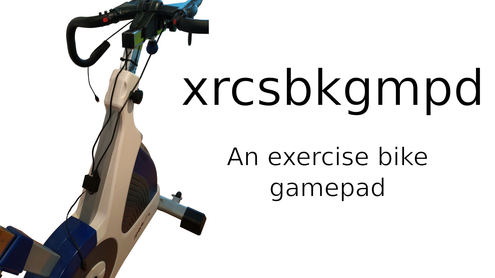
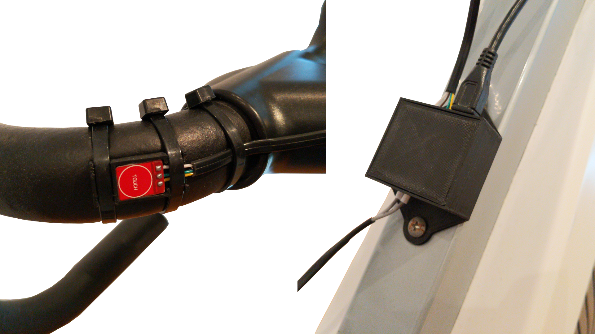
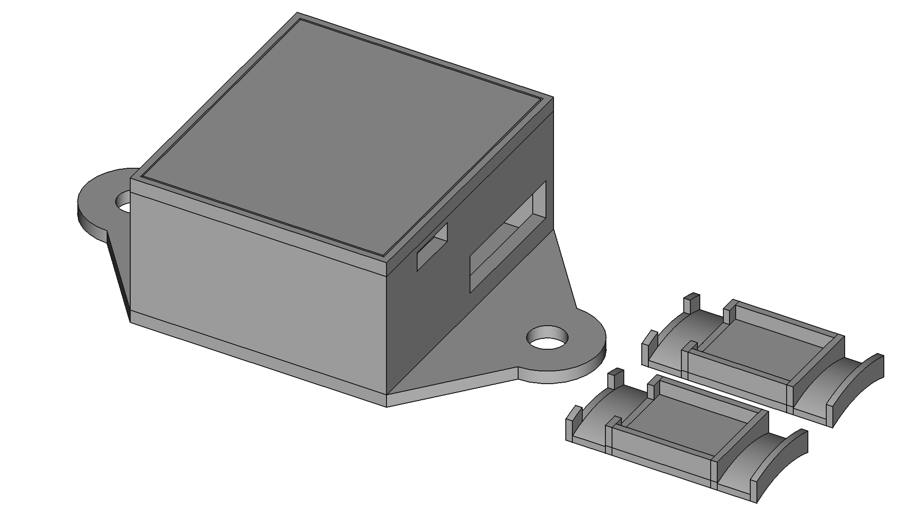

# xrcsbkgmpd

## Overview

This is an exercise bike gamepad I designed. In the default config it is set up to play [SuperTuxKart](https://supertuxkart.net/Main_Page) on a SportPlus SP-SRP-3000 exercise bike.

## Dependencies

I generally try to minimize dependencies, but I'm a one man crew and can therefore only support Debian-based Linux distributions as I'm running one myself. Anyway, you need to have the following packages installed for everything to work properly:

- FreeCAD for editing and exporting the CAD files. Install it with `sudo apt install freecad`.
- A2Plus for assemblying the different components in FreeCAD. Install it via the integrated addon manager.
- Arduino IDE as a way to compile the Arduino code. Install it with `sudo apt install arduino`.

## How to build it

This project is relatively straight forward as it mainly consists of an Arduino Pro Micro, one reed switch and 2 capacitive touch buttons all housed in 3D printed enclosures or simply glued onto the exercise bike in the case of the reed switch. For inspiration take a look at the overview image at the top as well as the mounting and assembly image down below.

Below is a full bill of materials with German sources for all non-printable parts:

| Quantity: | Item: | Source: |
| --- | --- | --- |
| 1 | Instant glue | [Amazon](https://www.amazon.de/Pattex-Sekundenkleber-L%C3%B6sungsmittelfreier-Gel-Kleber-Transparent/dp/B00O23B8IE) |
| 1 | Cables | [Amazon](https://www.amazon.de/Donau-Elektronik-GMBH-Original-Kupfer/dp/B01BI1G88C) |
| 1 | Perfboard, pin header and screw terminal kit | [Amazon](https://www.amazon.de/70Stk-Doppelseitig-Lochrasterplatte-Kit-Lochrasterplatine/dp/B07BDKG68Q) |
| 1 | Cable ties | [Amazon](https://www.amazon.de/Kabelbinder-Rscolila-Hochleistungs-Kabelmanagement-300mmx5mm/dp/B08ZC7PBSD) |
| 1 | Arduino Pro Micro | [Amazon](https://www.amazon.de/Micro-ATmega32U4-Arduino-Leonardo-%C3%A4hnlich/dp/B01D0OI90U) |
| 1 | Reed switch | [Amazon](https://www.amazon.de/Gebildet-Magnetschalter-Magnetischer-Normalerweise-Geschlossener/dp/B085XQLQ3N) |
| 2 | Capacitive touch sensors | [Amazon](https://www.amazon.de/YOUMILE-Touch-Switch-Taste-Selbstsperrmodul-30-Pin-Header-Dupont-Leitung/dp/B07TTH5ZH9) |
